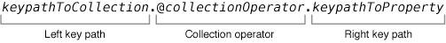

KVC 与 KVO 是 Cocoa 开发中非常基础的一组机制。前者提供了以字符串方式间接访问对象属性的能力，后者则建立在此之上，为对象属性变化提供观察与通知机制。理解它们的工作方式，有助于更准确地把握 iOS 运行时、数据绑定与对象通信的底层逻辑。

## KVC

### Key-Value Coding 基本原则

KVC（Key-Value Coding）是一种通过字符串标识符间接访问对象属性的机制。它能够在不直接调用属性访问器的前提下，完成对象属性的读取、写入以及集合操作，在提升灵活性的同时，也为许多 Cocoa 特性提供了基础支持。

### 访问对象属性

```objective-c
@interface BankAccount: NSobject

@property (nonatomic) NSNumber *currentBalance; // An attribute
@property (nonatomic) Person *owner; // A to-one relation
@property (nonatomic) NSArray <Transaction *>*transactions; // A to-many relation

@end
```

`currentBalance`、`owner`、`transactions` 都是 `BankAccount` 的属性。`owner` 属性本身是一个对象，它与 `BankAccount` 构成一对一关系；`owner` 对象内部属性的变化，并不等同于 `owner` 属性本身发生变化。

为了保持封装性，对象通常会通过访问器方法（accessor methods）对外暴露属性。但在使用访问器方法时，属性名称必须在编译期直接写入代码中，方法名也因此成为调用代码的静态组成部分。例如：`[myAccount setCurrentBalance:@(100.0)];`。这种方式在某些场景下不够灵活，而 KVC 则提供了一种更通用的机制，可以通过字符串标识符访问对象属性。

<!--more-->

### 使用 key 和 keyPath 标识对象的属性

**key**：用于标识某个特定属性的字符串。通常来说，属性的 key 就是属性名本身。key 必须使用 ASCII 编码，不能包含空格，并且通常以小写字母开头（URL 等特殊情况除外）。以上赋值过程如果使用 KVC 表示，则可以写成：`[myAccount setValue:@(100.0) forKey:@"currentBalance"];`

**keyPath**：用于指定一串以 `.` 分隔的属性访问路径。序列中的第一个 key 相对于消息接收者，后续每个 key 都相对于前一个 key 对应属性的值。当需要逐层向下访问对象层次结构时，keyPath 会非常有用。例如，`owner.address.street` 应用于银行账户实例时，表示存储在该账户所有者地址中的 `street` 字符串值。

### 访问集合属性

符合键值编码的对象，会以与公开普通属性相同的方式公开其多对多属性。你可以使用 `valueForKey:` 或 `setValue:forKey:` 来获取或设置集合属性。不过，当你需要直接操作集合内容时，使用协议定义的可变代理方法通常是更高效的方式。

该协议为集合对象访问定义了三类不同的代理方法，每类方法都同时提供了 key 和 keyPath 两个版本：

- `mutableArrayValueForKey:` 和 `mutableArrayValueForKeyPath:` 返回一个行为类似 `NSMutableArray` 的代理对象。
- `mutableSetValueForKey:` 和 `mutableSetValueFOrKeyPath:` 返回一个行为类似 `NSMutableSet` 的代理对象。
- `mutableOrderedSetValueForKey:` 和 `mutableOrderedSetValueForKeyPath:` 返回一个行为类似 `NSMutableOrderedSet` 的代理对象。

当你对这些代理对象执行添加、删除或替换元素等操作时，协议的默认实现会自动同步到底层属性。这种方式通常比先通过 `valueForKey:` 取得一个不可变集合、再复制成可变集合、修改后再通过 `setValue:forKey:` 写回更高效；在很多情况下，它也比直接操作可变属性本身更合适，因为这些方法还能帮助持有集合对象的对象维护良好的 KVO 行为。

```objective-c
- (void)accessingCollectionProperties {
    Transaction *t1 = [[Transaction alloc] init];
    Transaction *t2 = [[Transaction alloc] init];
    Account *myAccount = [[Account alloc] init];
    
    [myAccount addObserver:self forKeyPath:@"transactions" options:NSKeyValueObservingOptionOld | NSKeyValueObservingOptionNew context:nil];
    
    
    [myAccount setValue:@[t1, t2] forKey:@"transactions"];
    NSLog(@"1st transactions = %@", myAccount.transactions); // 1st transactions = ("<Transaction: 0x6000009d1400>","<Transaction: 0x6000009d1420>")
    NSMutableArray <Transaction *>*transactions = [myAccount mutableArrayValueForKey:@"transactions"];
    
    [transactions addObject:[[Transaction alloc] init]];
    NSLog(@"2nd transactions = %@", myAccount.transactions); // 2nd transactions = ("<Transaction: 0x6000009d1400>","<Transaction: 0x6000009d1420>","<Transaction: 0x6000009cabf0>")
    
    [transactions removeLastObject];
    NSLog(@"3th transactions = %@", myAccount.transactions); // 3th transactions = ("<Transaction: 0x6000009d1400>","<Transaction: 0x6000009d1420")
}
```

### 使用集合操作符

当你向符合键值编码的对象发送 `valueForKeyPath:` 消息时，可以在 keyPath 中嵌入集合操作符。集合操作符是一组以 `@` 开头的关键字，用来指定 getter 在返回结果前应如何对数据进行处理。`NSObject` 为 `valueForKeyPath:` 提供了默认实现。

当 keyPath 包含集合操作符时，运算符之前的部分称为左键路径，用来表示相对于消息接收者需要操作的集合；如果直接对一个集合对象（例如 `NSArray`）发送消息，则左键路径有时可以省略。运算符之后的部分称为右键路径，用来指定操作符应处理的集合属性。除 `@count` 外，所有操作符都需要右键路径。



集合操作符主要表现出以下三类行为：

- **聚合运算符**：以某种方式聚合集合中的对象，并返回一个通常与右键路径属性数据类型相匹配的单个对象。`@count` 是一个例外，它不需要右键路径，且始终返回一个 `NSNumber` 实例。包括：`@avg`、`@count`、`@max`、`@min`、`@sum`。
- **数组运算符**：返回一个 `NSArray` 实例，其中包含命名集合中对象的某个子集。包括：`@distinctUnionOfObjects`、`@unionOfObjects`。
- **嵌套运算符**：用于处理“集合中的集合”，并根据操作符返回一个 `NSArray` 或 `NSSet` 实例，以某种方式组合嵌套集合中的对象。包括：`@distinctUnionOfArrays`、`@unionOfArrays`、`@distinctUnionOfSets`。

```objective-c
- (void)usingCollectionOperators {
    Transaction *t1 = [Transaction transactionWithPayee:@"Green Power" amount:@(120.00) date:[NSDate dateWithTimeIntervalSinceNow:100]];
    Transaction *t3 = [Transaction transactionWithPayee:@"Green Power" amount:@(170.00) date:[NSDate dateWithTimeIntervalSinceNow:300]];
    Transaction *t5 = [Transaction transactionWithPayee:@"Car Loan" amount:@(250.00) date:[NSDate dateWithTimeIntervalSinceNow:500]];
    Transaction *t6 = [Transaction transactionWithPayee:@"Car Loan" amount:@(250.00) date:[NSDate dateWithTimeIntervalSinceNow:600]];
    Transaction *t13 = [Transaction transactionWithPayee:@"Animal Hospital" amount:@(600.00) date:[NSDate dateWithTimeIntervalSinceNow:500]];
    
    NSArray *transactions = @[t1, t3, t5, t6, t13];
    
    /* 聚合运算符
     * 聚合运算符可以处理数组或属性集，从而生成反映集合某些方面的单个值。
     */
    // @avg 平均值
    NSNumber *transactionAverage = [transactions valueForKeyPath:@"@avg.amount"];
    NSLog(@"transactionAverage = %@", transactionAverage); // transactionAverage = 278
    // @count 个数
    NSNumber *numberOfTransactions = [transactions valueForKeyPath:@"@count"];
    NSLog(@"numberOfTransactions = %@", numberOfTransactions); // numberOfTransactions = 5
    // @max 最大值 使用compare:进行比较
    NSDate *latestDate = [transactions valueForKeyPath:@"@max.date"];
    NSLog(@"latestDate = %@", latestDate); // latestDate = Thu Nov  1 15:05:59 2018
    // @min 最小值 使用compare:进行比较
    NSDate *earliestDate = [transactions valueForKeyPath:@"@min.date"];
    NSLog(@"earliestDate = %@", earliestDate);// earliestDate = Thu Nov  1 14:57:39 2018
    // @sum 总和
    NSNumber *amountSum = [transactions valueForKeyPath:@"@sum.amount"];
    NSLog(@"amountSum = %@", amountSum); // amountSum = 1390
    
    /* 数组运算符
     *
     * 数组运算符导致valueForKeyPath:返回与右键路径指示的特定对象集相对应的对象数组。
     * 如果使用数组运算符时任何叶对象为nil，则valueForKeyPath：方法会引发异常。
     **/
    // @distinctUnionOfObjects 创建并返回一个数组，该数组包含与右键路径指定的属性对应的集合的不同对象。会删除重复对象。
    NSArray *distinctPayees = [transactions valueForKeyPath:@"@distinctUnionOfObjects.payee"];
    NSLog(@"distinctPayees = %@", distinctPayees); // distinctPayees = ("Green Power", "Animal Hospital", "Car Loan")
    
    // @unionOfObjects 创建并返回一个数组，该数组包含与右键路径指定的属性对应的集合的所有对象。不删除重复对象
    NSArray *payees = [transactions valueForKeyPath:@"@unionOfObjects.payee"];
    NSLog(@"payees = %@", payees); // payees = ("Green Power", "Green Power", "Car Loan", "Car Loan", "Animal Hospital")
    
    /** 嵌套运算符
     *
     * 嵌套运算符对嵌套集合进行操作，集合中的每个条目都包含一个集合。
     * 如果使用数组运算符时任何叶对象为nil，则valueForKeyPath：方法会引发异常。
     **/
    Transaction *moreT1 = [Transaction transactionWithPayee:@"General Cable - Cottage" amount:@(120.00) date:[NSDate dateWithTimeIntervalSinceNow:10]];
    Transaction *moreT2 = [Transaction transactionWithPayee:@"General Cable - Cottage" amount:@(1550.00) date:[NSDate dateWithTimeIntervalSinceNow:3]];
    Transaction *moreT7 = [Transaction transactionWithPayee:@"Hobby Shop" amount:@(600.00) date:[NSDate dateWithTimeIntervalSinceNow:160]];
    NSArray *moreTransactions = @[moreT1, moreT2, moreT7];
    NSArray *arrayOfArrays = @[transactions, moreTransactions];
    // @distinctUnionOfArrays  指定@distinctUnionOfArrays运算符时，valueForKeyPath:创建并返回一个数组，该数组包含与右键路径指定的属性对应的所有集合的组合的不同对象。
    NSArray *collectedDistinctPayees = [arrayOfArrays valueForKeyPath:@"@distinctUnionOfArrays.payee"];
    NSLog(@"collectedDistinctPayees = %@", collectedDistinctPayees); // collectedDistinctPayees = ( "General Cable - Cottage", "Animal Hospital", "Hobby Shop", "Green Power", "Car Loan")
    // @unionOfArrays 与@distinctUnionOfArrays 不同的是不会删除相同的元素
    NSArray *collectedPayees = [arrayOfArrays valueForKeyPath:@"@unionOfArrays.payee"];
    NSLog(@"collectedPayees = %@", collectedPayees); // collectedPayees = ("Green Power", "Green Power", "Car Loan", "Car Loan", "Animal Hospital", "General Cable - Cottage", "General Cable - Cottage", "Hobby Shop")
    
    // @distinctUnionOfSets 与@distinctUnionOfArrays作用相同，只是用于NSSet对象而不是NSArray
}
```

- 获取数组里的“最大、最小、平均、求和”

```objective-c
NSArray *array = @[@"1",@"3",@2,@9.5,@"1.2"]; 
NSNumber *sum = [array valueForKeyPath:@"@sum.floatValue"]; 
NSNumber *avg = [array valueForKeyPath:@"@avg.floatValue"]; 
NSNumber *max = [array valueForKeyPath:@"@max.floatValue"]; 
NSNumber *min = [array valueForKeyPath:@"@min.floatValue"];  
NSLog(@"sum:%@",sum); 
NSLog(@"avg:%@",avg);
NSLog(@"max:%@",max); 
NSLog(@"min:%@",min);
```

- 删除重复数据

```objective-c
NSArray *array = @[@"name", @"w", @"aa", @"zxp", @"aa"]; //返回的是一个新的数组
NSArray *newArray = [array valueForKeyPath:@"@distinctUnionOfObjects.self"]; 
NSLog(@"%@", newArray);
```

- 同样可以嵌套使用，先剔除 `name` 对应值的重复数据再取值

```objective-c
NSArray *array = @[ @{@"title":@"zxp",@"name":@"zhangxiaoping"}, @{@"title":@"zxp2",@"name":@"zhangxiaoping2"}, @{@"title":@"zxp",@"name":@"zhangxiaoping3"}, @{@"title":@"zxp",@"name":@"zhangxiaoping"}];
//根据name字段，来进行重复删除。
NSArray *newArray = [array valueForKeyPath:@"@distinctUnionOfObjects.name"];
//如果要根据title字段来删除重名的写法为`@distinctUnionOfObjects.title` 
NSLog(@"%@", newArray);
/* print:( zhangxiaoping3, zhangxiaoping2, zhangxiaoping)是一个字符串数组 */

```

- 进行实例方法的调用

```objective-c
NSArray *array = @[@"name", @"w", @"aa", @"ZXPing"]; 
NSLog(@"%@", [array valueForKeyPath:@"uppercaseString"]);
```

这相当于对数组中的每个成员都执行了一次 `uppercaseString` 方法，再将返回结果组成一个新数组返回。既然可以使用 `uppercaseString`，那么 `NSString` 的其他实例方法同样也可以，例如 `[array valueForKeyPath:@"length"]`。对于其他对象的实例方法，也可以按照同样的方式类推使用。

### 访问者搜索模式

`NSObject` 提供的 **NSKeyValueCoding** 协议默认实现，会按照一套明确定义的规则，将基于 key 的访问请求映射到对象底层的属性。这些协议方法会使用给定的 **key**，在对象实例中依次搜索访问器方法、实例变量以及符合命名规则的相关方法。

虽然在实际开发中你很少需要修改这套默认搜索流程，但理解它的工作方式仍然很有价值：一方面可以帮助你分析键值编码对象的行为，另一方面也有助于让你自己的对象更好地兼容 KVC。

### Getter 的搜索模式

`valueForKey:` 的默认实现会将 `key` 作为输入，并在接收 `valueForKey:` 消息的类实例中按以下顺序进行查找：

1. 按顺序搜索访问器方法 `get<Key>`、`<key>`、`is<Key>`、`_<key>`。如果找到，就调用该方法，并带着返回结果跳转到第 5 步；否则继续下一步。
2. 如果没有找到简单访问器方法，则搜索名称符合特定模式的一组方法。其中匹配模式包括 `countOf<Key>`、`objectIn<Key>AtIndex:`（对应 `NSArray` 定义的基本方法）和 `<key>AtIndexs:`（对应 `NSArray` 的 `objectsAtIndexs:`）。一旦找到第一个方法以及后两个方法中的至少一个，就会创建一个集合代理对象并返回，使其响应 `NSArray` 的相关方法；否则进入第 3 步。实际上，这种代理机制使底层属性即便本身不是 `NSArray`，在外部看来也可以表现出类似 `NSArray` 的行为。
3. 如果既没有找到简单访问器方法，也没有找到数组访问方法组，则继续寻找 `countOf<Key>`、`enumeratorOf<Key>`、`memberOf<Key>:` 这三个方法，它们分别对应 `NSSet` 类的基本行为。如果三者都存在，则创建一个集合代理对象来响应所有 `NSSet` 方法并返回；否则进入第 4 步。
4. 如果以上方法都未找到，并且接收者的类方法 `accessInstanceVariablesDirectly` 返回 `YES`（默认值也是 `YES`），则按顺序搜索以下实例变量：`_<key>`、`_is<Key>`、`<key>`、`is<Key>`。如果找到其中之一，就直接读取该实例变量的值并跳转到第 5 步；否则进入第 6 步。
5. 如果检索到的属性值是对象指针，则直接返回；如果值是 `NSNumber` 支持的标量类型，则将其包装为 `NSNumber` 实例后返回；如果结果是 `NSNumber` 不支持的标量类型，则会被包装为 `NSValue` 对象后返回。
6. 如果以上所有尝试都失败，则调用 `valueForUndefinedKey:`。该方法默认会抛出异常，`NSObject` 的子类可以通过重写它来自定义行为。

### Setter 的搜索模式

`setValue:forKey:` 的默认实现会将 `key` 和 `value` 作为输入，尝试把 `value` 设置给以 `key` 命名的属性，过程如下：

1. 按顺序搜索 `set<Key>:` 或 `_set<Key>`。如果找到，则使用输入参数调用并结束。
2. 如果没有找到简单访问器方法，并且类方法 `accessInstanceVariablesDirectly` 返回 `YES`（默认为 `YES`），则按顺序搜索以下实例变量：`_<key>`、`_is<Key>`、`<key>`、`is<Key>`。如果找到，就直接赋值并结束。
3. 如果以上方式都失败，则调用 `setValue:forUndefinedKey:`。该方法默认会抛出异常，`NSObject` 的子类可以重写它以实现自定义行为。

## KVO

Key-Value Observing 提供了一种机制，使对象能够将自身属性的变化通知给其他对象。它在应用程序的 Model 层与 Controller 层之间尤其有用。通常，控制器对象会观察模型对象的属性，视图对象则通过控制器间接响应模型属性变化。另外，一个模型对象也可能观察另一个模型对象，甚至观察自身，以便在从属值发生变化时及时做出响应。

你可以观察简单属性、一对一关系以及多对多关系。对于多对多关系，观察者不仅能够获知发生了变化，还能知道变化的类型，以及变化涉及了哪些对象。

### 注册 KVO

- 使用 `addObserver:forKeyPath:options:context:` 方法为 observer 注册 observed object。
- 在 observer 内部实现 `observeValueForKeyPath:ofObject:change:context:` 来接收变化通知。
- 当不再需要接收通知时，使用 `removeObserver:forKeyPath:` 方法移除观察者。至少应在 observer 被销毁前完成移除。

### 兼容 KVO

为了让某个属性符合 KVO 标准，类通常需要满足以下条件：

- 该类对该属性是 KVC 兼容的。
- 该类会为该属性触发 KVO 通知。
- 相关的 key 已经被成功注册。

确保发出 KVO 通知主要有两种方式。`NSObject` 默认提供自动支持，对于符合键值编码的类，其大多数属性都可以直接获得自动通知。通常情况下，只要遵守 Cocoa 的编码规范与命名约定，就可以依赖自动通知，而不需要编写额外代码。

手动通知则为触发时机提供了更细粒度的控制，但也需要开发者自行编写额外代码。你可以通过实现 `automaticallyNotifiesObserversForKey:` 来控制子类属性是否启用自动通知。

### 注册从属 keys

在很多情况下，一个属性的值依赖于同一对象或其他对象中的一个或多个属性。如果这些底层属性发生变化，那么由它们派生出的属性也应当被标记为已变化，以便观察者能够收到正确通知。

### Key-Value Observing 的实现细节

自动的 Key-Value Observing 是通过一种称为 *isa-swizzling* 的技术实现的。

`isa` 指针会指向对象所属的类，而类中维护着一张调度表（dispatch table）。这张调度表中包含指向该类方法实现的指针以及其他相关数据。

当观察者注册某个对象的属性后，被观察对象的 `isa` 指针可能会被修改，使其指向一个中间类，而不再直接指向原始类。因此，`isa` 指针的值并不一定能够真实反映实例的实际类型。

正因为如此，不应依赖 `isa` 指针来判断对象所属的类，而应该使用 `class` 方法来确定实例的类型。
