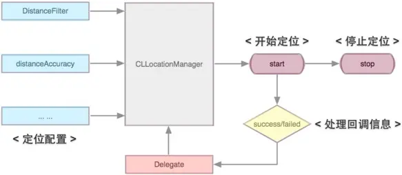
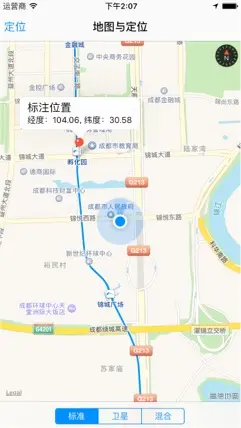

本文系统介绍 iOS 开发中地图与定位功能的实现方案，涵盖 Core Location 定位服务、地理编码与逆地理编码，以及 MapKit 框架下的地图展示、大头针标注和导航路线绘制等核心内容。

<!--more-->

## 定位

### 定位功能概述

- 定位主要用于获取用户当前地理位置信息。
- 常用的定位技术：
    - GPS 定位（全球定位系统，最精准的定位方式）
    - Skyhook Wi-Fi 定位（基于 Wi-Fi 路由器）
    - 因特网提供商定位技术（基于提供商中心站）
    - 多种定位方法混合使用
- Core Location 是 iOS 中实现定位功能的框架，提供了丰富的接口用于配置定位功能及获取地理位置数据。
- 使用 Core Location 需要导入框架：`CoreLocation.framework`。
- Core Location 提供了 `CLLocationManager` 类来管理定位功能，包括定位配置、启动和停止定位等操作。
- Core Location 同时提供了 `CLLocationManagerDelegate` 委托协议，用于处理定位过程中触发的各类事件。

### CLLocationManager 工作流程


### 定位授权

iOS 8 以后，使用定位功能需要请求用户授权，首次运行时系统会弹框提示：

```objective-c
// 请求在使用期间授权定位，需在 Info.plist 中添加 NSLocationWhenInUseUsageDescription
- (void)requestWhenInUseAuthorization;

// 请求始终授权定位，需在 Info.plist 中添加 NSLocationAlwaysUsageDescription
- (void)requestAlwaysAuthorization;
```

### CLLocationManager 常用属性

```objective-c
// 设置代理
@property (nonatomic, weak) id<CLLocationManagerDelegate> delegate;
// 设置定位频率，每隔多少米定位一次
@property (nonatomic, assign) CLLocationDistance distanceFilter;
// 设置定位精度
@property (nonatomic, assign) CLLocationAccuracy desiredAccuracy;
```

### CLLocationManager 常用方法

类方法：

```objective-c
// 是否启用定位服务，通常如果用户未启用定位服务可以提示用户开启
+ (BOOL)locationServicesEnabled;

// 定位服务授权状态，返回枚举类型
+ (CLAuthorizationStatus)authorizationStatus;
```

实例方法：

```objective-c
// 开始定位追踪
- (void)startUpdatingLocation;
// 停止定位追踪
- (void)stopUpdatingLocation;
// 开始导航方向追踪
- (void)startUpdatingHeading;
// 停止导航方向追踪
- (void)stopUpdatingHeading;
```

代理方法：

```objective-c
// 定位失败
- (void)locationManager:(CLLocationManager *)manager
       didFailWithError:(NSError *)error;

// 位置发生改变后执行（首次定位到某个位置后也会执行）
- (void)locationManager:(CLLocationManager *)manager
     didUpdateLocations:(NSArray<CLLocation *> *)locations;

// 导航方向发生变化后执行
- (void)locationManager:(CLLocationManager *)manager
       didUpdateHeading:(CLHeading *)newHeading;

// 进入某个区域后执行
- (void)locationManager:(CLLocationManager *)manager
         didEnterRegion:(CLRegion *)region;

// 离开某个区域后执行
- (void)locationManager:(CLLocationManager *)manager
          didExitRegion:(CLRegion *)region;
```

### CLLocationManager 定位代码示例

```objective-c
#import "ViewController.h"
#import <CoreLocation/CoreLocation.h>

@interface ViewController () <CLLocationManagerDelegate>

@property (nonatomic, strong) CLLocationManager *locationManager;

@end

@implementation ViewController

- (void)viewDidLoad {
    [super viewDidLoad];

    // 1. 判断设备是否开启定位服务
    if (![CLLocationManager locationServicesEnabled]) {
        UIAlertController *alert = [UIAlertController alertControllerWithTitle:@"提示"
                                                                      message:@"您的设备暂未开启定位服务"
                                                               preferredStyle:UIAlertControllerStyleAlert];
        [alert addAction:[UIAlertAction actionWithTitle:@"确定"
                                                  style:UIAlertActionStyleDefault
                                                handler:nil]];
        [self presentViewController:alert animated:YES completion:nil];
        return;
    }

    // 2. 初始化定位服务
    self.locationManager = [[CLLocationManager alloc] init];

    // 3. 请求定位授权
    [self.locationManager requestWhenInUseAuthorization];

    // 4. 设置定位精度
    self.locationManager.desiredAccuracy = kCLLocationAccuracyBest;

    // 5. 设置定位频率，每隔多少米定位一次
    self.locationManager.distanceFilter = 10.0;

    // 6. 设置代理
    self.locationManager.delegate = self;

    // 7. 开始定位（较耗电，不需要时应调用 stopUpdatingLocation 停止定位）
    [self.locationManager startUpdatingLocation];
}

#pragma mark - CLLocationManagerDelegate

- (void)locationManager:(CLLocationManager *)manager didFailWithError:(NSError *)error {
    NSLog(@"%@", error.localizedDescription);
}

- (void)locationManager:(CLLocationManager *)manager didUpdateLocations:(NSArray<CLLocation *> *)locations {
    CLLocation *location = locations.lastObject;
    NSLog(@"纬度：%.2f, 经度：%.2f", location.coordinate.latitude, location.coordinate.longitude);
    [self.locationManager stopUpdatingLocation];
}

@end
```

注意事项：

- 定位频率和定位精度并非越高越好，需根据实际场景选择，精度越高越耗电。
- 定位成功后会根据配置频繁调用 `didUpdateLocations:` 方法，该方法返回 `CLLocation` 对象数组，每个元素包含经度、纬度、海拔、行走速度等信息。返回数组是因为某些情况下一个位置点可能包含多条位置记录。
- 使用完定位服务后，如不需要实时监控应立即关闭以节省资源。
- 除定位功能外，`CLLocationManager` 还可调用 `startMonitoringForRegion:` 方法对指定区域进行监控。

## 地理编码

除了位置跟踪功能外，Core Location 还提供了 `CLGeocoder` 类用于处理地理编码和逆地理编码（反地理编码）。

- 地理编码：根据给定的地名确定地理坐标（经度、纬度）。
- 逆地理编码：根据地理坐标（经度、纬度）确定位置信息（街道、门牌等）。

### 地理编码方法

```objective-c
// 地理编码
- (void)geocodeAddressString:(NSString *)addressString
           completionHandler:(CLGeocodeCompletionHandler)completionHandler;

// 逆地理编码
- (void)reverseGeocodeLocation:(CLLocation *)location
             completionHandler:(CLGeocodeCompletionHandler)completionHandler;
```

### 地理编码示例

```objective-c
#import "ViewController.h"
#import <CoreLocation/CoreLocation.h>

@interface ViewController ()

@property (nonatomic, strong) CLGeocoder *geocoder;

@end

@implementation ViewController

- (void)viewDidLoad {
    [super viewDidLoad];
    self.geocoder = [[CLGeocoder alloc] init];
    [self getCoordinateByAddress:@"成都"];
    [self getAddressByLatitude:39.54 longitude:116.28];
}

#pragma mark - 根据地名确定地理坐标

- (void)getCoordinateByAddress:(NSString *)address {
    [self.geocoder geocodeAddressString:address completionHandler:^(NSArray<CLPlacemark *> *placemarks, NSError *error) {
        // 取得第一个地标（注意：一个地名可能对应多个地址）
        CLPlacemark *placemark = placemarks.firstObject;
        CLLocation *location = placemark.location;
        CLRegion *region = placemark.region;
        NSDictionary *addressDic = placemark.addressDictionary;
        NSLog(@"\n位置：%@\n区域：%@\n详细信息：%@", location, region, addressDic);
    }];
}

#pragma mark - 根据坐标取得地名

- (void)getAddressByLatitude:(CLLocationDegrees)latitude longitude:(CLLocationDegrees)longitude {
    CLLocation *location = [[CLLocation alloc] initWithLatitude:latitude longitude:longitude];
    [self.geocoder reverseGeocodeLocation:location completionHandler:^(NSArray<CLPlacemark *> *placemarks, NSError *error) {
        if (error) {
            NSLog(@"%@", error.localizedDescription);
        } else {
            CLPlacemark *placemark = placemarks.firstObject;
            NSLog(@"详细信息：%@", placemark.addressDictionary);
        }
    }];
}

@end
```

注意：地理编码和逆地理编码不可同时执行。

## 地图

iOS 6.0 起，系统地图数据不再由 Google 提供，改用 Apple 自有地图服务（国内数据由高德地图提供）。本文仅讨论 iOS 6.0 及以后版本的地图开发。

iOS 中进行地图开发主要有两种方式：一是直接使用 MapKit 框架，可对地图进行精确控制；二是调用系统自带地图应用，适用于简单的导航等场景。本节重点介绍前者。

MapKit 框架中的 `MKMapView` 类提供了系统地图界面，配合 Core Location 可展示丰富的位置信息。使用 MapKit 需要导入框架：`MapKit.framework`。

### MKMapView 常用属性

- `showsUserLocation`：是否显示用户位置
- `userTrackingMode`：跟踪类型（枚举）

```objective-c
MKUserTrackingModeNone              // 不进行用户位置跟踪
MKUserTrackingModeFollow            // 跟踪用户位置
MKUserTrackingModeFollowWithHeading // 跟踪用户位置及前进方向
```

- `showsTraffic`：是否显示交通状况（iOS 9）
- `showsScale`：是否显示比例尺（iOS 9）
- `showsCompass`：是否显示指南针（iOS 9）
- `userLocation`：用户位置信息（只读）
- `userLocation.title`：用户位置标题
- `userLocation.subtitle`：用户位置子标题
- `annotations`：当前地图中的所有大头针（只读）
- `mapType`：地图类型

```objective-c
MKMapTypeStandard         // 标准地图
MKMapTypeSatellite        // 卫星地图
MKMapTypeHybrid           // 混合地图，加载较慢且消耗资源
MKMapTypeSatelliteFlyover // iOS 9，卫星地图，支持城市观光
MKMapTypeHybridFlyover    // iOS 9，混合地图，支持城市观光
```

### MKMapView 常用方法

初始化方法：

```objective-c
- (instancetype)initWithFrame:(CGRect)frame;
```

实例方法：

```objective-c
// 添加大头针（对应有添加大头针数组的方法）
- (void)addAnnotation:(id<MKAnnotation>)annotation;

// 删除大头针（对应有删除大头针数组的方法）
- (void)removeAnnotation:(id<MKAnnotation>)annotation;

// 设置地图显示区域
- (void)setRegion:(MKCoordinateRegion)region animated:(BOOL)animated;

// 设置地图中心点位置
- (void)setCenterCoordinate:(CLLocationCoordinate2D)coordinate animated:(BOOL)animated;

// 将地理坐标转换为屏幕坐标
- (CGPoint)convertCoordinate:(CLLocationCoordinate2D)coordinate toPointToView:(nullable UIView *)view;

// 将屏幕坐标转换为地理坐标
- (CLLocationCoordinate2D)convertPoint:(CGPoint)point toCoordinateFromView:(nullable UIView *)view;

// 从缓存池中取出大头针视图（类似 UITableView 的复用机制）
- (nullable MKAnnotationView *)dequeueReusableAnnotationViewWithIdentifier:(NSString *)identifier;

// 选中指定大头针
- (void)selectAnnotation:(id<MKAnnotation>)annotation animated:(BOOL)animated;

// 取消选中指定大头针
- (void)deselectAnnotation:(nullable id<MKAnnotation>)annotation animated:(BOOL)animated;
```

代理方法：

```objective-c
// 用户位置发生改变时触发（首次定位也会触发）
- (void)mapView:(MKMapView *)mapView didUpdateUserLocation:(MKUserLocation *)userLocation;

// 地图加载完成后触发
- (void)mapViewDidFinishLoadingMap:(MKMapView *)mapView;

// 显示大头针时触发，返回大头针视图（自定义大头针通过此方法实现）
- (nullable MKAnnotationView *)mapView:(MKMapView *)mapView viewForAnnotation:(id<MKAnnotation>)annotation;

// 选中某个大头针时触发
- (void)mapView:(MKMapView *)mapView didSelectAnnotationView:(MKAnnotationView *)view;

// 取消选中大头针时触发
- (void)mapView:(MKMapView *)mapView didDeselectAnnotationView:(MKAnnotationView *)view;

// 渲染地图覆盖物时触发
- (MKOverlayRenderer *)mapView:(MKMapView *)mapView rendererForOverlay:(id<MKOverlay>)overlay;
```
### 用户位置跟踪

在很多地图类应用中，打开地图后通常会立即显示用户当前位置，并将当前位置置于屏幕中央，便于用户查看周边环境。对于 iOS 8 及以后版本，由于用户位置跟踪依赖定位功能，因此必须先完成前文所述的定位授权配置与请求。

需要注意的是：

- 在 iOS 8 中，启用用户位置跟踪后，地图通常会自动以当前位置为中心并设置合适的显示区域。
- `mapView:didUpdateUserLocation:` 方法会在首次定位成功后调用，之后每当用户位置发生变化都会再次触发，调用频率较高。

### 大头针标注

在 iOS 地图开发中，经常需要对某个位置进行标记，这类标记通常被称为“大头针”。任何继承自 `NSObject` 且实现 `MKAnnotation` 协议的对象，都可以作为地图标注对象。通常需要实现以下属性：

- `coordinate`：标记位置
- `title`：标题
- `subtitle`：子标题

在业务代码中创建标注对象后，调用 `addAnnotation:` 即可将其添加到地图上。下面示例演示了如何通过长按手势在地图中添加一个标注。



```objective-c
- (void)respondsToGesture:(UILongPressGestureRecognizer *)gesture {
    // 当长按手势开始时，添加一个标注
    if (gesture.state == UIGestureRecognizerStateBegan) {
        // 获取长按点在地图上的坐标
        CGPoint point = [gesture locationInView:self.mapView];

        // 将屏幕坐标转换为经纬度坐标
        CLLocationCoordinate2D coordinate = [self.mapView convertPoint:point toCoordinateFromView:self.mapView];

        // 创建系统提供的标注对象
        MKPointAnnotation *annotation = [[MKPointAnnotation alloc] init];
        annotation.coordinate = coordinate;
        annotation.title = @"标注位置";
        annotation.subtitle = [NSString stringWithFormat:@"经度：%.2f, 纬度：%.2f", coordinate.longitude, coordinate.latitude];

        // 添加标注到地图
        [self.mapView addAnnotation:annotation];
    }
}
```

### 自定义标注视图

在实际项目中，系统默认的大头针样式往往无法满足需求，此时可以通过 `mapView:viewForAnnotation:` 返回自定义的 `MKAnnotationView` 或其子类来修改标注样式。

`MKPinAnnotationView` 是 `MKAnnotationView` 的子类，常用属性包括：

- `pinTintColor`：设置大头针前景色（iOS 9 新特性）
- `animatesDrop`：设置大头针下落动画效果

`MKAnnotationView` 常用属性如下：

```objective-c
@property (nonatomic, strong, nullable) UIImage *image;
@property (nonatomic, assign, getter=isSelected) BOOL selected;
@property (nonatomic, strong, nullable) id<MKAnnotation> annotation;
@property (nonatomic, assign) CGPoint calloutOffset;
@property (nonatomic, strong, nullable) UIView *leftCalloutAccessoryView;
@property (nonatomic, strong, nullable) UIView *rightCalloutAccessoryView;
@property (nonatomic, assign) BOOL canShowCallout;
```

注意事项：

- 当某个大头针进入可视区域时，系统会调用该代理方法返回对应的大头针视图。
- 用户当前位置对应的蓝色圆点本质上也是一个标注，因此也会触发该代理方法，需要单独判断处理。
- 该方法调用频繁，应优先复用缓存池中的标注视图，以提升性能。
- 自定义标注视图默认可能不支持交互，如需点击显示标题和子标题，应将 `canShowCallout` 设为 `YES`。
- 如果该代理方法返回 `nil`，系统将使用默认标注视图。

下面示例演示了标注视图自定义，包括弹出视图、标注颜色和偏移量等设置：

```objective-c
- (MKAnnotationView *)mapView:(MKMapView *)mapView viewForAnnotation:(id<MKAnnotation>)annotation {
    // 用户当前位置使用系统默认样式
    if ([annotation isKindOfClass:[MKUserLocation class]]) {
        return nil;
    }

    static NSString * const kMKPinAnnotationViewIdentifier = @"identifier";

    MKPinAnnotationView *annotationView = (MKPinAnnotationView *)[mapView dequeueReusableAnnotationViewWithIdentifier:kMKPinAnnotationViewIdentifier];
    if (!annotationView) {
        annotationView = [[MKPinAnnotationView alloc] initWithAnnotation:annotation reuseIdentifier:kMKPinAnnotationViewIdentifier];
    }

    annotationView.annotation = annotation;
    annotationView.image = [UIImage imageNamed:@"pin"];
    annotationView.animatesDrop = YES;
    annotationView.canShowCallout = YES;
    annotationView.calloutOffset = CGPointMake(0, 1);
    annotationView.pinTintColor = [UIColor blueColor];

    UIButton *navigationButton = [UIButton buttonWithType:UIButtonTypeCustom];
    navigationButton.bounds = CGRectMake(0, 0, 100, 60);
    navigationButton.backgroundColor = [UIColor grayColor];
    [navigationButton setTitle:@"导航" forState:UIControlStateNormal];
    annotationView.rightCalloutAccessoryView = navigationButton;

    return annotationView;
}
```

## 导航

在自定义标注视图中添加导航按钮后，若按钮继承自 `UIControl`，无需额外绑定事件，点击后会自动触发 `calloutAccessoryControlTapped:` 相关代理方法。下面示例演示如何进行路线计算与绘制。


```objective-c
- (void)mapView:(MKMapView *)mapView
annotationView:(MKAnnotationView *)view
calloutAccessoryControlTapped:(UIControl *)control {
    if ([view.annotation.title isKindOfClass:[NSNull class]]) {
        return;
    }

    MKPlacemark *currentPlacemark = [[MKPlacemark alloc] initWithCoordinate:mapView.userLocation.coordinate
                                                          addressDictionary:nil];
    MKPlacemark *destinationPlacemark = [[MKPlacemark alloc] initWithCoordinate:((MKPointAnnotation *)view.annotation).coordinate
                                                              addressDictionary:nil];

    MKMapItem *currentItem = [[MKMapItem alloc] initWithPlacemark:currentPlacemark];
    MKMapItem *destinationItem = [[MKMapItem alloc] initWithPlacemark:destinationPlacemark];

    MKDirectionsRequest *directionRequest = [[MKDirectionsRequest alloc] init];
    directionRequest.source = currentItem;
    directionRequest.destination = destinationItem;
    directionRequest.transportType = MKDirectionsTransportTypeAutomobile;

    MKDirections *directions = [[MKDirections alloc] initWithRequest:directionRequest];

    [directions calculateDirectionsWithCompletionHandler:^(MKDirectionsResponse *response, NSError *error) {
        if (error || response.routes.count == 0) {
            NSLog(@"%@", error.localizedDescription);
            return;
        }

        MKRoute *route = response.routes.firstObject;
        [mapView addOverlay:route.polyline];
    }];

    [directions calculateETAWithCompletionHandler:^(MKETAResponse *response, NSError *error) {
        if (error) {
            NSLog(@"%@", error.localizedDescription);
            return;
        }
        NSLog(@"预计通行时间：%.2f", response.expectedTravelTime);
    }];
}

- (MKOverlayRenderer *)mapView:(MKMapView *)mapView rendererForOverlay:(id<MKOverlay>)overlay {
    MKPolylineRenderer *renderer = [[MKPolylineRenderer alloc] initWithOverlay:overlay];
    renderer.lineWidth = 2.0;
    renderer.strokeColor = [UIColor redColor];
    return renderer;
}
```

### 系统自带地图导航

若仅需调用系统地图应用进行导航，实现方式相对简单，只需构造 `MKMapItem` 并设置导航参数后调用系统地图即可。


```objective-c
#import "ViewController.h"
#import <CoreLocation/CoreLocation.h>
#import <MapKit/MapKit.h>

@interface ViewController ()

@property (nonatomic, strong) CLGeocoder *geocoder;

@end

@implementation ViewController

- (void)viewDidLoad {
    [super viewDidLoad];
    self.geocoder = [[CLGeocoder alloc] init];
    [self startNavigation];
}

- (void)startNavigation {
    [self.geocoder geocodeAddressString:@"成都市" completionHandler:^(NSArray<CLPlacemark *> *placemarks, NSError *error) {
        if (error || placemarks.count == 0) {
            NSLog(@"%@", error.localizedDescription);
            return;
        }

        CLPlacemark *clPlacemark1 = placemarks.firstObject;
        MKPlacemark *mkPlacemark1 = [[MKPlacemark alloc] initWithPlacemark:clPlacemark1];

        // 地理编码一次只能处理一个请求，第二个地点需在前一个完成后继续执行
        [self.geocoder geocodeAddressString:@"重庆市" completionHandler:^(NSArray<CLPlacemark *> *placemarks, NSError *error) {
            if (error || placemarks.count == 0) {
                NSLog(@"%@", error.localizedDescription);
                return;
            }

            CLPlacemark *clPlacemark2 = placemarks.firstObject;
            MKPlacemark *mkPlacemark2 = [[MKPlacemark alloc] initWithPlacemark:clPlacemark2];

            NSDictionary *options = @{
                MKLaunchOptionsMapTypeKey: @(MKMapTypeStandard),
                MKLaunchOptionsDirectionsModeKey: MKLaunchOptionsDirectionsModeDriving
            };

            MKMapItem *mapItem1 = [[MKMapItem alloc] initWithPlacemark:mkPlacemark1];
            MKMapItem *mapItem2 = [[MKMapItem alloc] initWithPlacemark:mkPlacemark2];

            [MKMapItem openMapsWithItems:@[mapItem1, mapItem2] launchOptions:options];
        }];
    }];
}

@end
```

### 特别说明

由于定位与地图框架涉及的类较多，初学者容易混淆，下面对几个常见类进行简要区分：

```objective-c
CLLocation    // 表示位置信息，包含地理坐标、海拔等，属于 CoreLocation 框架
MKUserLocation // 一个特殊的标注对象，用于表示用户当前位置
CLPlacemark   // Core Location 中的地标类，封装详细地理信息
MKPlacemark   // MapKit 中的地标类，可由 CLPlacemark 创建
```

