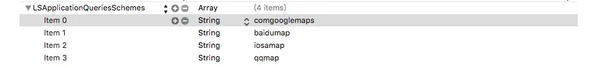

在 iOS 项目中接入第三方地图导航时，很多场景并不需要同时集成多家地图 SDK。对于“从当前页面拉起已安装地图 App 并发起导航”这类需求，直接通过 URI，也就是 iOS 中常见的 URL Scheme 方式进行跳转，通常更轻量，也更容易控制包体积和维护成本。本文整理了百度地图、高德地图、苹果地图、谷歌地图、腾讯地图的导航调用方式，并补充了多地图场景中常用的坐标转换代码。

<!--more-->


从 iOS 9 开始，如果要通过 URI 方式唤起百度地图、高德地图、腾讯地图、谷歌地图等 App，需要先在 `Info.plist` 中配置对应的 `LSApplicationQueriesSchemes`。配置示例如下：



以下示例默认使用驾车导航。

## 百度地图

### 使用说明
百度地图使用的是 BD-09 坐标，而高德地图、谷歌地图、腾讯地图常见的是 GCJ-02 坐标。如果直接把 GCJ-02 坐标传给百度地图，或者把百度坐标直接传给其他地图，导航位置通常会出现明显偏差。因此，多地图跳转场景下需要特别注意坐标系转换。文末提供了 GCJ-02 与 BD-09 的互转代码。

### 示例代码
需传入**起点和终点**的经纬度。

```objective-c
if ([[UIApplication sharedApplication] canOpenURL:[NSURL URLWithString:@"baidumap://map/"]]) {
    UIAlertAction *baiduMapAction = [UIAlertAction actionWithTitle:@"百度地图" style:UIAlertActionStyleDefault handler:^(UIAlertAction * _Nonnull action) {
        NSString *baiduParameterFormat = @"baidumap://map/direction?origin=latlng:%f,%f|name:我的位置&destination=latlng:%f,%f|name:终点&mode=driving";
        NSString *urlString = [[NSString stringWithFormat:
                                baiduParameterFormat,
                                userLocation.location.coordinate.latitude,
                                userLocation.location.coordinate.longitude,
                                self.destinationCoordinate.latitude,
                                self.destinationCoordinate.longitude]
                               stringByAddingPercentEscapesUsingEncoding:NSUTF8StringEncoding];
        [[UIApplication sharedApplication] openURL:[NSURL URLWithString:urlString]];
    }];
    [actionSheet addAction:baiduMapAction];
}
```

### 参考文档
各参数说明可参考[百度地图官方文档](http://lbsyun.baidu.com/index.php?title=uri/api/ios)。

## 高德地图

### 使用说明
高德地图只需要传入**终点**经纬度即可发起导航。如果希望用户从高德地图返回你的 App，需要正确填写 `backScheme=%@`，也就是你的 App 对应的 URL Scheme。

### 示例代码

```objective-c
if ([[UIApplication sharedApplication] canOpenURL:[NSURL URLWithString:@"iosamap://map/"]]) {
    UIAlertAction *gaodeMapAction = [UIAlertAction actionWithTitle:@"高德地图" style:UIAlertActionStyleDefault handler:^(UIAlertAction * _Nonnull action) {
        NSString *gaodeParameterFormat = @"iosamap://navi?sourceApplication=%@&backScheme=%@&poiname=%@&lat=%f&lon=%f&dev=1&style=2";
        NSString *urlString = [[NSString stringWithFormat:
                                gaodeParameterFormat,
                                @"yourAppName",
                                @"yourAppUrlSchema",
                                @"终点",
                                self.destinationCoordinate.latitude,
                                self.destinationCoordinate.longitude]
                               stringByAddingPercentEscapesUsingEncoding:NSUTF8StringEncoding];
        [[UIApplication sharedApplication] openURL:[NSURL URLWithString:urlString]];
    }];
    [actionSheet addAction:gaodeMapAction];
}
```

### 参考文档
各参数说明可参考[高德地图官方文档](http://lbs.amap.com/api/uri-api/guide/ios-uri-explain/navi/)。

## 苹果地图

### 使用说明
苹果地图需要传入**起点和终点**的经纬度，并导入头文件 `#import <MapKit/MKMapItem.h>`。

### 示例代码

```objective-c
[actionSheet addAction:[UIAlertAction actionWithTitle:@"苹果地图" style:UIAlertActionStyleDefault handler:^(UIAlertAction * _Nonnull action) {
    // 起点
    MKMapItem *currentLocation = [MKMapItem mapItemForCurrentLocation];
    CLLocationCoordinate2D desCorrdinate = CLLocationCoordinate2DMake(self.destinationCoordinate.latitude, self.destinationCoordinate.longitude);
    // 终点
    MKMapItem *toLocation = [[MKMapItem alloc] initWithPlacemark:[[MKPlacemark alloc] initWithCoordinate:desCorrdinate addressDictionary:nil]];
    // 默认驾车
    [MKMapItem openMapsWithItems:@[currentLocation, toLocation]
                   launchOptions:@{MKLaunchOptionsDirectionsModeKey:MKLaunchOptionsDirectionsModeDriving,
                                   MKLaunchOptionsMapTypeKey:[NSNumber numberWithInteger:MKMapTypeStandard],
                                   MKLaunchOptionsShowsTrafficKey:[NSNumber numberWithBool:YES]}];
}]];
```

### 参考文档
各参数说明可参考[苹果地图官方文档](https://developer.apple.com/library/ios/documentation/MapKit/Reference/MKMapItem_class/index.html)。

## 谷歌地图

### 使用说明
谷歌地图只需要传入**终点**经纬度即可。和高德类似，`x-source` 与 `x-success` 可以用于配置来源应用和返回 Scheme。

### 示例代码

```objective-c
if ([[UIApplication sharedApplication] canOpenURL:[NSURL URLWithString:@"comgooglemaps://map/"]]) {
    [actionSheet addAction:[UIAlertAction actionWithTitle:@"谷歌地图" style:UIAlertActionStyleDefault handler:^(UIAlertAction * _Nonnull action) {
        NSString *urlString = [[NSString stringWithFormat:@"comgooglemaps://?x-source=%@&x-success=%@&saddr=&daddr=%f,%f&directionsmode=driving",
                                appName,
                                urlScheme,
                                coordinate.latitude,
                                coordinate.longitude]
                               stringByAddingPercentEscapesUsingEncoding:NSUTF8StringEncoding];
        [[UIApplication sharedApplication] openURL:[NSURL URLWithString:urlString]];
    }]];
}
```

### 参考文档
各参数说明可参考[谷歌地图官方文档](https://developers.google.com/maps/documentation/ios/urlscheme)。

## 腾讯地图

### 使用说明
腾讯地图示例中需要传入**起点和终点**经纬度，同时通过 `refer` 标识来源应用。

### 示例代码

```objective-c
if ([[UIApplication sharedApplication] canOpenURL:[NSURL URLWithString:@"qqmap://map/"]]) {
    [actionSheet addAction:[UIAlertAction actionWithTitle:@"腾讯地图" style:UIAlertActionStyleDefault handler:^(UIAlertAction * _Nonnull action) {
        NSString *QQParameterFormat = @"qqmap://map/routeplan?type=drive&fromcoord=%f, %f&tocoord=%f,%f&coord_type=1&policy=0&refer=%@";
        NSString *urlString = [[NSString stringWithFormat:
                                QQParameterFormat,
                                userLocation.location.coordinate.latitude,
                                userLocation.location.coordinate.longitude,
                                self.destinationCoordinate.latitude,
                                self.destinationCoordinate.longitude,
                                @"yourAppName"]
                               stringByAddingPercentEscapesUsingEncoding:NSUTF8StringEncoding];
        [[UIApplication sharedApplication] openURL:[NSURL URLWithString:urlString]];
    }]];
}
```

### 参考文档
各参数说明可参考[腾讯地图官方文档](http://lbs.qq.com/uri_v1/guide-route.html)。

## GCJ-02 与 BD-09 坐标互转

### GCJ-02 转 BD-09

```objective-c
/** *  将GCJ-02坐标转换为BD-09坐标 即将高德地图上获取的坐标转换成百度坐标 */
- (CLLocationCoordinate2D)gcj02CoordianteToBD09:(CLLocationCoordinate2D)gdCoordinate
{
    double x_PI = M_PI * 3000.0 /180.0;

    double gd_lat = gdCoordinate.latitude;

    double gd_lon = gdCoordinate.longitude;

    double z = sqrt(gd_lat * gd_lat + gd_lon * gd_lon) + 0.00002 * sin(gd_lat * x_PI);

    double theta = atan2(gd_lat, gd_lon) + 0.000003 * cos(gd_lon * x_PI);

    return CLLocationCoordinate2DMake(z * sin(theta) + 0.006, z * cos(theta) + 0.0065);
}
```

### BD-09 转 GCJ-02

```objective-c
/** *  将BD-09坐标转换为GCJ-02坐标 即将百度地图上获取的坐标转换成高德地图的坐标 */
- (CLLocationCoordinate2D)bd09CoordinateToGCJ02:(CLLocationCoordinate2D)bdCoordinate
{
    double x_PI = M_PI * 3000.0 /180.0;

    double bd_lat = bdCoordinate.latitude - 0.006;

    double bd_lon = bdCoordinate.longitude - 0.0065;

    double z = sqrt(bd_lat * bd_lat + bd_lon * bd_lon) - 0.00002 * sin(bd_lat * x_PI);

    double theta = atan2(bd_lat, bd_lon) - 0.000003 * cos(bd_lon * x_PI);

    return CLLocationCoordinate2DMake(z * sin(theta), z * cos(theta));
}
```

## 地图坐标系转换

### 分类声明

```objective-c
#import <CoreLocation/CoreLocation.h>
/*
 从 CLLocationManager 取出来的经纬度放到 mapView 上显示，是错误的!
 从 CLLocationManager 取出来的经纬度去 Google Maps API 做逆地址解析，当然是错的！
 从 MKMapView 取出来的经纬度去 Google Maps API 做逆地址解析终于对了。去百度地图API做逆地址解析，依旧是错的！
 从上面两处取的经纬度放到百度地图上显示都是错的！错的！的！

 分为 地球坐标，火星坐标（iOS mapView 高德 ， 国内google ,搜搜、阿里云 都是火星坐标），百度坐标(百度地图数据主要都是四维图新提供的)

 火星坐标: MKMapView
 地球坐标: CLLocationManager

 当用到CLLocationManager 得到的数据转化为火星坐标, MKMapView不用处理


 API                坐标系
 百度地图API         百度坐标
 腾讯搜搜地图API      火星坐标
 搜狐搜狗地图API      搜狗坐标
 阿里云地图API       火星坐标
 图吧MapBar地图API   图吧坐标
 高德MapABC地图API   火星坐标
 灵图51ditu地图API   火星坐标
 */
@interface CLLocation (Location)

// 从地图坐标转化到火星坐标
- (CLLocation *)locationMarsFromEarth;

// 从火星坐标转化到百度坐标
- (CLLocation *)locationBaiduFromMars;

// 从百度坐标到火星坐标
- (CLLocation *)locationMarsFromBaidu;

// 从火星坐标到地图坐标
- (CLLocation *)locationEarthFromMars;

// 从百度坐标到地图坐标
- (CLLocation *)locationEarthFromBaidu;

@end
```

### 实现代码

```objective-c
#import "CLLocation+Location.h"

void transform_earth_from_mars(double lat, double lng, double* tarLat, double* tarLng);
void transform_mars_from_baidu(double lat, double lng, double* tarLat, double* tarLng);
void transform_baidu_from_mars(double lat, double lng, double* tarLat, double* tarLng);

@implementation CLLocation (Location)

- (CLLocation*)locationMarsFromEarth
{
    double lat = 0.0;
    double lng = 0.0;
    transform_earth_from_mars(self.coordinate.latitude, self.coordinate.longitude, &lat, &lng);
    return [[CLLocation alloc] initWithCoordinate:CLLocationCoordinate2DMake(lat+self.coordinate.latitude, lng+self.coordinate.longitude)
                                         altitude:self.altitude
                               horizontalAccuracy:self.horizontalAccuracy
                                 verticalAccuracy:self.verticalAccuracy
                                           course:self.course
                                            speed:self.speed
                                        timestamp:self.timestamp];
}

- (CLLocation*)locationEarthFromMars
{
    double lat = 0.0;
    double lng = 0.0;
    transform_earth_from_mars(self.coordinate.latitude, self.coordinate.longitude, &lat, &lng);
    return [[CLLocation alloc] initWithCoordinate:CLLocationCoordinate2DMake(self.coordinate.latitude-lat, self.coordinate.longitude-lng)
                                         altitude:self.altitude
                               horizontalAccuracy:self.horizontalAccuracy
                                 verticalAccuracy:self.verticalAccuracy
                                           course:self.course
                                            speed:self.speed
                                        timestamp:self.timestamp];
    return nil;
}

- (CLLocation*)locationBaiduFromMars
{
    double lat = 0.0;
    double lng = 0.0;
    transform_mars_from_baidu(self.coordinate.latitude, self.coordinate.longitude, &lat, &lng);
    return [[CLLocation alloc] initWithCoordinate:CLLocationCoordinate2DMake(lat, lng)
                                         altitude:self.altitude
                               horizontalAccuracy:self.horizontalAccuracy
                                 verticalAccuracy:self.verticalAccuracy
                                           course:self.course
                                            speed:self.speed
                                        timestamp:self.timestamp];
}

- (CLLocation*)locationMarsFromBaidu
{
    double lat = 0.0;
    double lng = 0.0;
    transform_baidu_from_mars(self.coordinate.latitude, self.coordinate.longitude, &lat, &lng);
    return [[CLLocation alloc] initWithCoordinate:CLLocationCoordinate2DMake(lat, lng)
                                         altitude:self.altitude
                               horizontalAccuracy:self.horizontalAccuracy
                                 verticalAccuracy:self.verticalAccuracy
                                           course:self.course
                                            speed:self.speed
                                        timestamp:self.timestamp];
}

-(CLLocation*)locationEarthFromBaidu
{
    double lat = 0.0;
    double lng = 0.0;
    CLLocation *Mars = [self locationMarsFromBaidu];

    transform_earth_from_mars(Mars.coordinate.latitude, Mars.coordinate.longitude, &lat, &lng);
    return [[CLLocation alloc] initWithCoordinate:CLLocationCoordinate2DMake(Mars.coordinate.latitude-lat, Mars.coordinate.longitude-lng)
                                         altitude:self.altitude
                               horizontalAccuracy:self.horizontalAccuracy
                                 verticalAccuracy:self.verticalAccuracy
                                           course:self.course
                                            speed:self.speed
                                        timestamp:self.timestamp];
    return nil;
}

@end


// --- transform_earth_from_mars ---
// 参考来源：https://on4wp7.codeplex.com/SourceControl/changeset/view/21483#353936
// Krasovsky 1940
//
// a = 6378245.0, 1/f = 298.3
// b = a * (1 - f)
// ee = (a^2 - b^2) / a^2;
const double a = 6378245.0;
const double ee = 0.00669342162296594323;

bool transform_sino_out_china(double lat, double lon)
{
    if (lon < 72.004 || lon > 137.8347)
        return true;
    if (lat < 0.8293 || lat > 55.8271)
        return true;
    return false;
}

double transform_earth_from_mars_lat(double x, double y)
{
    double ret = -100.0 + 2.0 * x + 3.0 * y + 0.2 * y * y + 0.1 * x * y + 0.2 * sqrt(fabs(x));
    ret += (20.0 * sin(6.0 * x * M_PI) + 20.0 * sin(2.0 * x * M_PI)) * 2.0 / 3.0;
    ret += (20.0 * sin(y * M_PI) + 40.0 * sin(y / 3.0 * M_PI)) * 2.0 / 3.0;
    ret += (160.0 * sin(y / 12.0 * M_PI) + 320 * sin(y * M_PI / 30.0)) * 2.0 / 3.0;
    return ret;
}

double transform_earth_from_mars_lng(double x, double y)
{
    double ret = 300.0 + x + 2.0 * y + 0.1 * x * x + 0.1 * x * y + 0.1 * sqrt(fabs(x));
    ret += (20.0 * sin(6.0 * x * M_PI) + 20.0 * sin(2.0 * x * M_PI)) * 2.0 / 3.0;
    ret += (20.0 * sin(x * M_PI) + 40.0 * sin(x / 3.0 * M_PI)) * 2.0 / 3.0;
    ret += (150.0 * sin(x / 12.0 * M_PI) + 300.0 * sin(x / 30.0 * M_PI)) * 2.0 / 3.0;
    return ret;
}

void transform_earth_from_mars(double lat, double lng, double* tarLat, double* tarLng)
{
    if (transform_sino_out_china(lat, lng))
    {
        *tarLat = lat;
        *tarLng = lng;
        return;
    }
    double dLat = transform_earth_from_mars_lat(lng - 105.0, lat - 35.0);
    double dLon = transform_earth_from_mars_lng(lng - 105.0, lat - 35.0);
    double radLat = lat / 180.0 * M_PI;
    double magic = sin(radLat);
    magic = 1 - ee * magic * magic;
    double sqrtMagic = sqrt(magic);
    dLat = (dLat * 180.0) / ((a * (1 - ee)) / (magic * sqrtMagic) * M_PI);
    dLon = (dLon * 180.0) / (a / sqrtMagic * cos(radLat) * M_PI);
    *tarLat = dLat;
    *tarLng = dLon;
}

// --- transform_earth_from_mars end ---
// --- transform_mars_vs_bear_paw ---
// 参考来源：http://blog.woodbunny.com/post-68.html
const double x_pi = M_PI * 3000.0 / 180.0;

void transform_mars_from_baidu(double gg_lat, double gg_lon, double *bd_lat, double *bd_lon)
{
    double x = gg_lon, y = gg_lat;
    double z = sqrt(x * x + y * y) + 0.00002 * sin(y * x_pi);
    double theta = atan2(y, x) + 0.000003 * cos(x * x_pi);
    *bd_lon = z * cos(theta) + 0.0065;
    *bd_lat = z * sin(theta) + 0.006;
}

void transform_baidu_from_mars(double bd_lat, double bd_lon, double *gg_lat, double *gg_lon)
{
    double x = bd_lon - 0.0065, y = bd_lat - 0.006;
    double z = sqrt(x * x + y * y) - 0.00002 * sin(y * x_pi);
    double theta = atan2(y, x) - 0.000003 * cos(x * x_pi);
    *gg_lon = z * cos(theta);
    *gg_lat = z * sin(theta);
}
```

### 补充说明
无论导入的是百度 SDK 还是高德 SDK，它们内部通常都封装了自身坐标体系相关的转换能力；但对于高德坐标、百度坐标与其他坐标系之间的互转，接口支持并不总是完整，且不同版本文档可能存在差异。实际接入时，建议结合当前 SDK 版本与真实设备导航结果一并验证。
